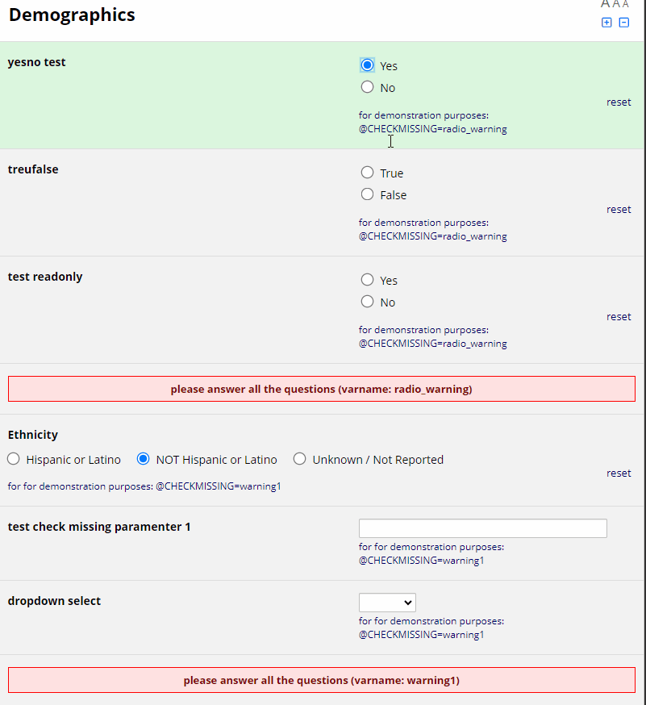
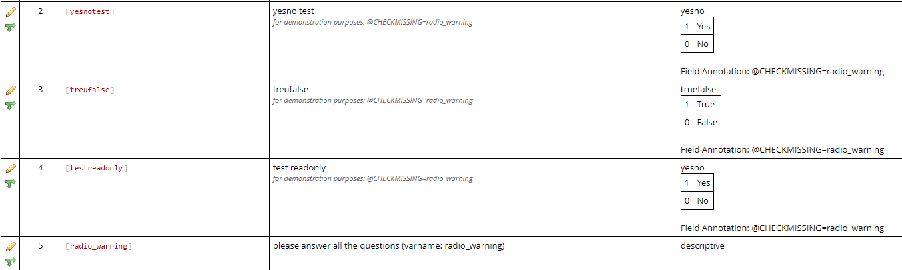

# Check for missing

**Use Case:** Show a warning text if variables are not complete:

This module hides (with the action tag @HIDDEN) a variable [varX] (i.e., a descriptive field with a warning message) if any other variable tagged with the Action Tag @CHECKMISSING=varX is not empty.

**Rationale:** Instead of writing long branching logic for [varX], you can quickly tag (working with the data dictionary) the variables to take into consideration with the Action Tag @CHECKMISSING. For the end-user, it looks exactly like branching logic, but the side implementation might speed up the creation of forms.

**Notes:**
 * The module look for the variables tagged with @CHECKMISSING which are available in the current page. By multi-page survey only variables in the current section will be "checked for missing values"
 * @READONLY fields are considered as not-missing. 

**Codebook:**
| Variable / Field Name | Field Label                             | Field Note                                                        | Field Attributes (Field Type, Validation, Choices, Calculations, etc.) |
|-----------------------|-----------------------------------------|-------------------------------------------------------------------|------------------------------------------------------------------------|
| [yesnotest]           | yesno test                              | for demonstration purposes: @CHECKMISSING=radio_warning           | yesno   1 Yes   0 No   Field Annotation: @CHECKMISSING=radio_warning  |
| [treufalse]           | treufalse                               | for demonstration purposes: @CHECKMISSING=radio_warning           | truefalse   1 True   0 False   Field Annotation: @CHECKMISSING=radio_warning |
| [testreadonly]        | test readonly                           | for demonstration purposes: @CHECKMISSING=radio_warning           | yesno   1 Yes   0 No   Field Annotation: @CHECKMISSING=radio_warning |
| [radio_warning]       | please answer all the questions         | (varname: radio_warning)                                          | descriptive                                                             |

